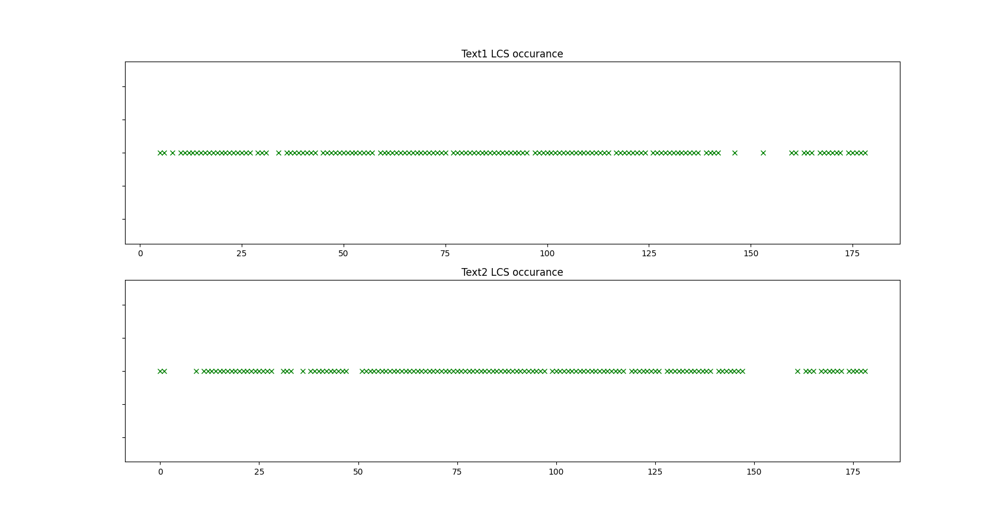

# Find Similar Documents (using LCS) 
**This project is a Algorithms Design Course (Winter 2020) Project of [Computer Engineering Bu-Ali Sina University](http://eng.basu.ac.ir/en/ce)**. In this project, a similar-document-finder is implemented, that will try to find similar documents on the web-based on some given documents. It measures how much the documents are close to each other. For more thorough project documentation, click doc/main.pdf. [doc/main.pdf](doc/main.pdf).
### Phases
- [x] Implementing LCS
- [x] Similarity and Dependency Score
- [x] Scrape specific website documents and compare it to a given document
- [x] Find similar codes to the given code in Geekforgeeks website
- [ ] General approach of finding similar documents on Google
### Application Installation
Install Python3 on your machine.
By the following command in the directory of the cloned project
you can install a command-line application.
``` bash
$ pip install --editable .
```
### Examples
Now **docsim** should be installed in your machine.
To make sure, write following command on your terminal.
You should see the following result.
``` bash
$ docsim --help

Usage: docsim [OPTIONS] COMMAND [ARGS]...

  Simple CLI for finding similarity between codes

Options:
  --help  Show this message and exit.

Commands:
  check-dir       Find most similar pairs for each file in the directory.
  check-files     Check the similarity of two code files.
  clean-comments  Remove c-style and python-style comments for each file in the directory.
  query           Search files on the google.

```
If the result is the same, you are good to use other commands. There are some code samples in the folder code-samples of the project. By the following command, you can find the most similar pairs in the folder:
### example 1
``` bash
$ docsim check-dir  code-samples
file1: code06.cpp
file2: code01.cpp 
Similarity Score: 98.90%
dependency Score: (98.90%, 100.00%)

file1: code01.cpp
file2: code06.cpp 
Similarity Score: 98.90%
dependency Score: (100.00%, 98.90%)

file1: code05.cpp
file2: code02.cpp 
Similarity Score: 74.19%
dependency Score: (81.66%, 89.03%)

file1: code02.cpp
file2: code05.cpp 
Similarity Score: 74.19%
dependency Score: (89.03%, 81.66%)

file1: code04.py
file2: code03.py 
Similarity Score: 26.11%
dependency Score: (42.16%, 40.69%)

file1: code03.py
file2: code04.py 
Similarity Score: 26.11%
dependency Score: (40.69%, 42.16%)

``` 
You can search codes on **Geeksforgeeks** by some keywords and if will return the URL that has the most similar result by it's score and a figure of
LCS occurance distribution as shown below.

### example 2
``` bash
$ docsim query --file code-samples/code01.cpp -k 'n queen' --plot

url:https://www.geeksforgeeks.org/n-queen-problem-backtracking-3/ 
Similarity Score: 65.30%
dependency Score: (79.44%, 78.57%)
LCS:
"
define N void int board N N for int i 0 i N i for int j 0 j N j 
board i j bool int board N N int row int col int i 0 i col i 
if board row i return false for i row j col i 0 j 0 i j if board 
i j return false for i row j col j 0 i N i j if board i j return 
false return true bool int board N N int col if col N return true 
for int i 0 i N i if board i col board i col 1 if board col 1 
return true board i col 0 return false bool int board N N 0 0 0 
if board 0 false Solution does not exist return false board 
return true int main"
```


